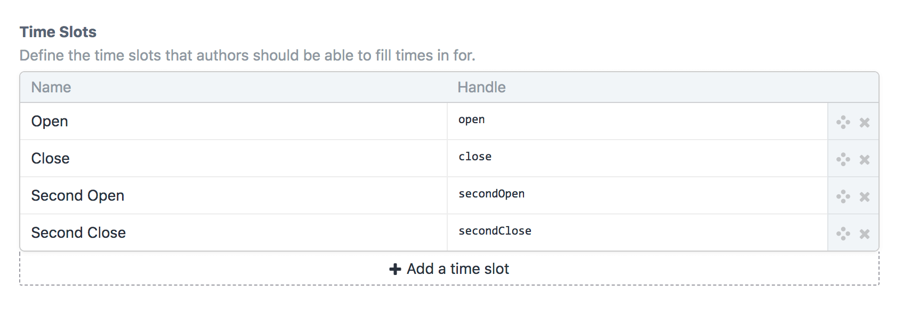
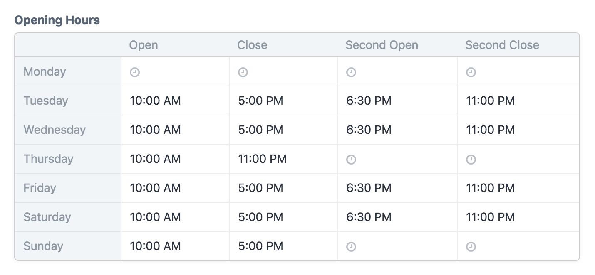

# Store Hours for Craft CMS

This plugin adds a new “Store Hours” field type to Craft, for collecting the opening and closing hours (or any other time slots) of an organization for each day of the week.

## Requirements

This plugin requires Craft CMS 3.0.0-beta.20 or later.

## Installation

To install the plugin, follow these instructions.

1. Open your terminal and go to your Craft project:

    ```bash
    cd /path/to/project
    ```

2. Then tell Composer to load the plugin:

    ```bash
    composer require craftcms/store-hours
    ```

3. In the Control Panel, go to Settings → Plugins and click the “Install” button for Store Hours.

4. You can now create a Store Hours field type under Settings → Fields.

## Customizing Time Slots

Store Hours fields have a setting called “Time Slots” that lets you customize the time columns that will be visible in the field inputs. By default there will be two time slots, “Opening Time” and “Closing Time”, but you can customize those however you like.



Each row you add here will end up adding a new column to the field inputs.

  

## Templating

You can loop through your Store Hours fields to access info for each day of the week (starting with Sunday):

```twig
<h3>Opening Hours</h3>
<dl>
    
        <dt>{{ day.name }}</dt>
        <dd>
            
                Closed
            
                {{ day.open|time }} - {{ day.close|time }}
            
        </dd>
    
</dl>
```

The exact time format that will be used when outputting times with the `|time` filter depends on the current application locale. See the [Craft documentation](https://docs.craftcms.com/v3/dev/filters.html#time) for details on how it can be customized.

### Showing Today’s Hours

To only show _today’s_ hours, use the `getToday()` field method:

```twig
<h3>Today’s Hours</h3>


    <p>Sorry, we’re closed today.</p>

    <p>We’re open from {{ today.open|time }} to {{ today.close|time }} today.</p>

``` 

### Showing a Custom Day Range

To only show certain days of the week (e.g only Monday through Friday), use the `getRange()` field method. Pass two integers in to represent the start and end days of the range, using this mapping:

| Number | Day       |
| ------ | --------- |
| `0`    | Sunday    |
| `1`    | Monday    |
| `2`    | Tuesday   |
| `3`    | Wednesday |
| `4`    | Thursday  |
| `5`    | Friday    |
| `6`    | Saturday  |

```twig
{# Only show Monday-Friday #}



    {# ... #}

```

### Changing the Week Start Day

You can use the `getRange()` field method to return the full list of days with a different week start day. For example, if you want Monday to be the first day of the week, do this:

```twig
{# Show all days with Monday first #}



    {# ... #}

```

As a shortcut, you can also skip passing the end day when you want to do this:

```twig
{# Show all days with Monday first #}



    {# ... #}

```

### Determining Whether All Slots are Blank

You can quickly find out whether all the time slots in a day were left blank using the `getIsBlank()` (`isBlank`) field method:

```twig
<h3>Opening Hours</h3>
<dl>
    
        <dt>{{ day.name }}</dt>
        <dd>
            
                Closed
            
                {{ day.open|time }} - {{ day.close|time }}
            
        </dd>
    
</dl>
```
